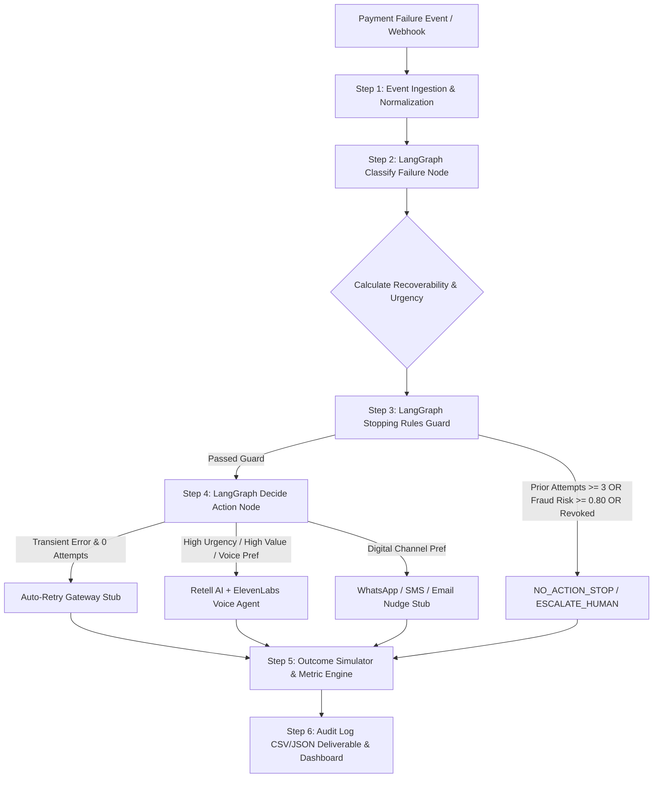

# Razorpay Autonomous Payment Recovery & Intervention Engine 🚀

An intelligent, multi-channel payment recovery system built with **LangGraph**, designed to dynamically triage failed transactions, enforce safety & DND stopping rules, execute low-cost digital interventions (WhatsApp, SMS, Email, Auto-Retry), and dispatch high-differentiator **Voice Agent Call Payloads** (Retell AI + ElevenLabs).

---

## 🏗️ System Architecture & Workflow



---

## 📦 Project Structure

```
razorpay_proj/
├── frontend/                    # Frontend application
│   ├── dashboard.html          # Interactive visual executive dashboard
│   └── package.json            # Frontend dependencies
├── backend/                     # Backend application
│   ├── server.py               # FastAPI server with WebSocket support
│   ├── voice_service.py        # Voice LLM calling service
│   ├── duplex_voice_handler.py # Full-duplex real-time voice handler
│   ├── payment_workflow.py     # Payment workflow integration
│   ├── razorpay_integration.py # Razorpay gateway integration
│   ├── triage_graph.py         # LangGraph triage engine
│   ├── execution_tools.py      # Execution tools for interventions
│   ├── outcome_simulator.py    # Outcome simulation & metrics
│   ├── generate_dataset.py    # Synthetic dataset generator
│   ├── run_pipeline.py         # End-to-end pipeline runner
│   ├── voice_calls/            # Generated voice call audio files
│   ├── events.csv              # Synthetic payment failure events
│   ├── audit_log.csv           # Persistent audit trail
│   ├── audit_log.json          # Structured audit report
│   ├── requirements.txt        # Python dependencies
│   └── .env.example            # Environment variables template
├── test_audio/                  # Test audio files
├── .gitignore                  # Git ignore rules
├── README.md                   # This file
└── test_structure.py           # Structure validation tests
```

---

## 🚀 Quickstart & Deployment

### Prerequisites
- Python 3.9+
- API Keys: Groq API Key, ElevenLabs API Key

### 1. Environment Setup

Copy the example environment file and add your API keys:

```bash
cd backend
cp .env.example .env
```

Edit `.env` and add your actual API keys:
```
GROQ_API_KEY=your_actual_groq_api_key
ELEVENLABS_API_KEY=your_actual_elevenlabs_api_key
```

### 2. Local Development

#### Backend Development:
```bash
cd backend
pip install -r requirements.txt
uvicorn server:app --reload --host 0.0.0.0 --port 8000
```

#### Frontend Development:
```bash
cd frontend
# Option 1: Using Python
python -m http.server 3000

# Option 2: Using Node (after npm install)
npm install
npm run serve
```

The application will be available at:
- **Frontend**: http://localhost:3000
- **Backend API**: http://localhost:8000
- **API Documentation**: http://localhost:8000/docs

---

## 🎯 Step-by-Step Build Order Realized

| Step | Component | Status | Highlights |
| :--- | :--- | :---: | :--- |
| **Step 1** | **Synthetic Dataset** | ✅ Complete | 150 events generated with realistic skew (`insufficient_funds`, `card_expired`, `bank_decline`, `otp_abandon`, `cash_flow_delay`, `genuine_abandonment`). |
| **Step 2** | **LangGraph Triage Engine** | ✅ Complete | 2-Node StateGraph (`classify_failure` -> `decide_action`). Computes `recoverability_score` (0-1) and `urgency` (`CRITICAL`, `HIGH`, `MEDIUM`, `LOW`). |
| **Step 3** | **Stopping Rules & Audit Trail** | ✅ Complete | Halts execution if `prior_attempts >= 3`, `risk_score >= 0.80`, or irrecoverable profile. Generates detailed `reason_string` and exports to `audit_log.csv`. |
| **Step 4** | **Execution Tools (Cheapest First)** | ✅ Complete | Implements WhatsApp/SMS/Email nudges, mock gateway retry stub (`/v1/payments/retry`), and Retell AI / ElevenLabs voice agent payload with objection handling. |
| **Step 5** | **Outcome Simulation & Metrics** | ✅ Complete | Probabilistic customer response model calculating recovered revenue (₹), total intervention cost (₹), net business ROI, and recovery rates. |
| **Step 6** | **Repo & Deliverables** | ✅ Complete | Public repo ready, architecture documentation, audit log deliverable, and interactive visual UI dashboard. |

---

## 📊 Live Simulation Results & Performance Benchmark (150 Events)

| Metric | Benchmark Result |
| :--- | :--- |
| **Total Failed Volume** | **₹23,82,611.53** |
| **Total Recovered Volume** | **₹11,58,347.81** |
| **Total Intervention Cost** | **₹179.65** |
| **Net Business Value Added** | **₹11,58,168.16** |
| **Volume Recovery Rate** | **48.62%** |
| **ROI Multiplier** | **6,446.8x ROI** |

---

## 🎙️ Voice Agent Configuration (Retell AI + ElevenLabs)

For high-urgency or high-value payment recoveries (e.g. ₹10,000+ or B2B overdue invoices), the system generates a dynamic Voice Agent payload:
- **Provider**: Retell AI + ElevenLabs
- **Voice Model**: `eleven_labs_riya_hinglish`
- **Dynamic Scripting**: Multilingual opening lines (Hinglish/Hindi/English) matching customer language preference.
- **Objection Handling Matrix**:
  - *Insufficient Funds*: Offers instant 1-click UPI schedule link or payday delay.
  - *Price Hesitation*: Offers instant 10% checkout discount.
  - *Invoice Dispute*: Automatically flags for internal billing escalation while capturing voice sentiment.

---

## 🔑 API Endpoints

### Backend API (FastAPI)

- `GET /` - Serve dashboard
- `GET /api/events` - Get all payment failure events
- `GET /api/voice/agents` - Get available voice agents
- `POST /api/voice/call` - Initiate voice call
- `POST /api/voice/transcribe` - Transcribe audio
- `POST /api/voice/respond` - Continue voice conversation
- `WS /ws/call/{event_id}` - WebSocket for real-time duplex voice
- `POST /api/razorpay/create_link` - Create Razorpay payment link
- `POST /api/razorpay/webhook` - Process Razorpay webhook
- `POST /api/payments/simulate` - Simulate payment checkout
- `GET /api/payments/test-cards` - Get test card details
- `GET /api/metrics` - Get recovery metrics
- `GET /api/audit/logs` - Get audit trail logs

---

## 🔒 Security & Deployment Notes

1. **API Keys**: Never commit `.env` file. Use `.env.example` as template
2. **CORS**: Configure appropriate CORS origins for production
3. **Rate Limiting**: Implement rate limiting for production API endpoints
4. **HTTPS**: Use HTTPS in production for WebSocket connections
5. **Database**: Consider using a proper database for production instead of CSV/JSON files

---

## 🛠️ Development Notes

### Voice Agent Switching
- The system automatically generates fresh transcripts when switching between voice agents (Swara ↔ Ava)
- Each agent switch resets the conversation session to prevent context bleeding
- WebSocket connections are properly cleaned up when switching agents

### Send Message Functionality
- The system uses voice-only interaction via "Hold to speak" button
- No manual text input/send buttons - voice input is automatically transcribed and sent
- This ensures natural conversation flow and reduces user friction

---

## 📝 License

MIT License - See LICENSE file for details

---

## 🤝 Contributing

1. Fork the repository
2. Create a feature branch
3. Commit your changes
4. Push to the branch
5. Create a Pull Request

---

## 📞 Support

For issues and questions, please open an issue on GitHub or contact the development team.